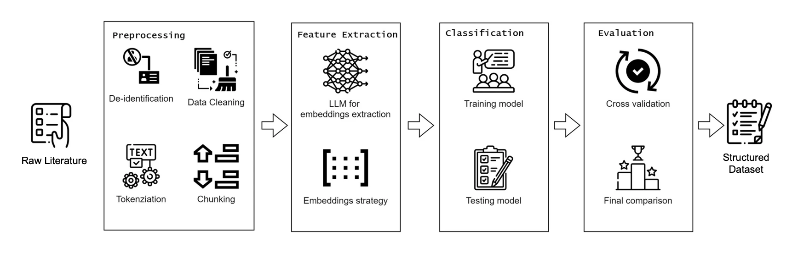

# PSCbench


**PSCbench** is a novel benchmark for materials science research-level scientific
dataset curation sourced from published journals. The benchmark is designed to evaluate the complex classification capabilities,
strong domain knowledge, and advanced calculation skills of LLMs. 

We developed an innovative **evaluation protocol** for a detailed analysis of classification abilities of leading commercially available Large Language Models. This
involves instructing LLMs to extract key knowledge information within a predefined set of
dataset template. This process offers a fine-grained understanding that LLM works as well as a human in annotating the data
and actually finds out when the humans failed to annotate the data
.


## Data


The PSCbench dataset is under dataset folder in json file format. Each file is list of dictionary and can be extracted using following scripts.
Each file stands for one published journal, which is fully elaborated in the paper. 

```
with open("./dataset/retroactive/{}.json".format(subject), encoding='utf-8') as json_file:
    problems=json.load(json_file)

```

## Evaluation
To evaluate our data using LLM, please refer to folder under eval

## Analysis (Evaluation Protocol)


The evaluation protocol involves analyzing both LLM
and reference (correct) ground truth with the assistance of human annotators to identify the key information in the literature.
These reasons are then summarized into 4 categories: Tag, Materials, Fabrication and Properties. Subsequently, a LLM verifier is employed to automatically attribute each
incorrectly extracted answer into a certain field. The resulting error profiles enable the
interpretation of the improved skills by certain prompting strategies and direct comparison of various
strategies.

### run evaluation protocol
After running the evaluation part, use the output to run the evaluation protocol. 
```
cd eval
OPENAI_API_KEY=your_key python ana_error.py --setting your_setting 
```

## Citation
If you find our paper useful, please cite our paper
```
@inproceedings{wang2024scibench,
author = {Wang, Xiaoxuan and Hu, Ziniu and Lu, Pan and Zhu, Yanqiao and Zhang, Jieyu and Subramaniam, Satyen and Loomba, Arjun R. and Zhang, Shichang and Sun, Yizhou and Wang, Wei},
title = {{SciBench: Evaluating College-Level Scientific Problem-Solving Abilities of Large Language Models}},
booktitle = {Proceedings of the Forty-First International Conference on Machine Learning},
year = {2024},
}
```
